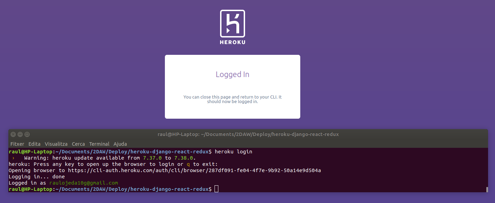

# Practica Heroku
## Raül Ojeda Gandia & Iván Pérez Fita
### Introducción

Heroku es un popular proveedor de plataforma como servicio (PaaS) que facilita a los desarrolladores el despliegue de aplicaciones web sin un equipo de operaciones. Heroku ha existido desde 2007, y ahora es propiedad de Salesforce .

Actualmente Heroku soporta Cloudant, Couchbase Server, MongoDB y Redis, además de la conocida base de datos PostgreSQL,​ tanto como parte de la plataforma o como servicio independente.

Las aplicaciones se corren desde un servidor Heroku usando Heroku DNS Server para apuntar al dominio de la aplicación (típicamente nombreaplicacion.herokuapp.com). Cada aplicación corre sobre un motor a través de una "red de bancos de prueba" que consta de varios servidores. El servidor Git de Heroku maneja los repositorios de las aplicaciones que son subidas por los usuarios. 

### Primeros pasos
Lo primero que hay que hacer es crear un repositorio en github con el codigo que queremos desplegar, en este caso hemos usado el frontend que hemos desarollado en el modulo de servidor. [Entrando aqui](https://github.com/Zar21/heroku-django-react-redux) podras ver el repositorio.

Ahora vamos a instalar heroku mediante snap 
```bash 
sudo snap install heroku --classic 
```

### Login

Ahora nos registraremos en la web de heroku
Cuando ya estemos registrados debemos ejecutar:
```bash
heroku login
```
Y logeara a nuestra maquina en heroku usando la cuenta que acabamos de registrar.



### Creación de heroku

Ahora dentro de la carpeta donde tenemos el repositorio vamos a ejecutar
```bash
heroku create
```
//img here

Tenemos que configurar un procfile para indicar con que comando ejecutaremos la aplicación 

//img here
Cuando tengamos el procfile ya podremos ejecutar
```bash
git add .
git commit -m "Procfile added"
git push heroku master
```
//img here

Ahora la aplicación estara desplegada
### Heroku remoto
Una vez haya terminado deberemos ejecutar
```bash
heroku ps:scale web=1
```
Teniendo una instancia de la app activa

Si queremos ver la aplicación en la url remota hay que ejecutar
```bash
heroku open
```

### Heroku Local
Antes de ejecutar heroku en local debes asegurarte de haber realizado un npm install para tener todas las dependencias de la web.

Para desplegar heroku en local realizaremos este comando:
```bash
heroku local web 
```
Y la aplicación saldra de manera basica por el puerto 5000

### Configuración de variables de entorno
#### Local
Para crear variables de entorno en heroku local debemos crear un archivo .env donde configuraremos las variables que necesitemos
//img here

Mediante react podemos mostrar el contenido de estas variables

//img here
#### Remoto
A diferencia del local en el remoto deberemos configurar las variables de entorno mediante el comando:
//img here
Igual que en local mediante react podemos mostrar el contenido delas variables de entorno

//img here
### Add-ons

